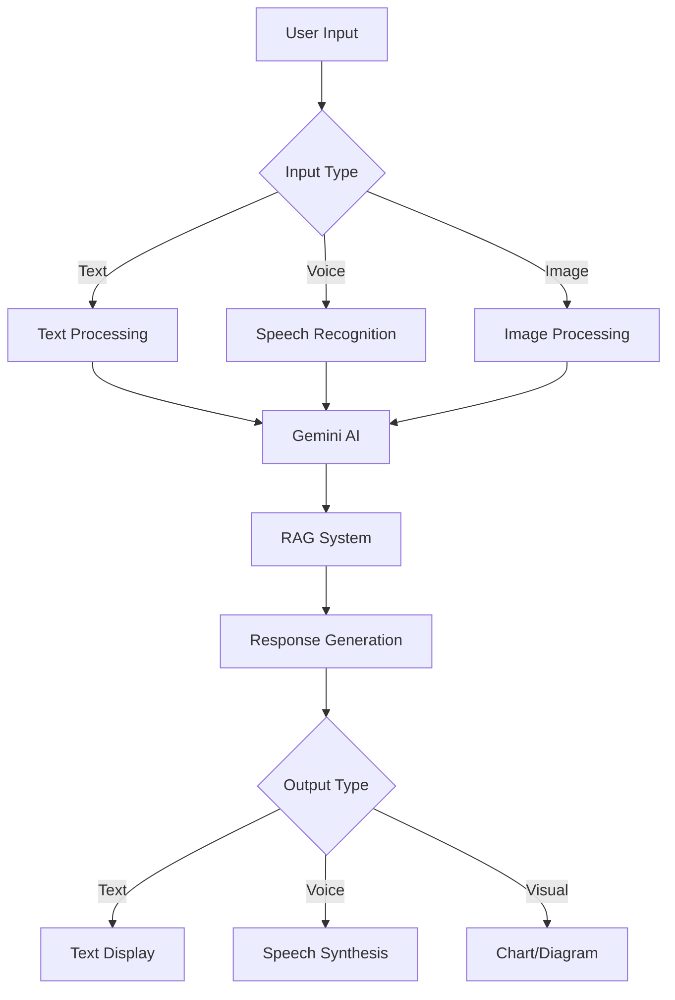

# 🚦 G-Traffic Heroes


<p align="center">
  <strong>🇻🇳 Ứng dụng AI thông minh cho giáo dục An toàn Giao thông Việt Nam</strong>
</p>

<p align="center">
  <a href="#tính-năng-chính">Tính năng</a> •
  <a href="#công-nghệ">Công nghệ</a> •
  <a href="#cài-đặt">Cài đặt</a> •
  <a href="#sử-dụng">Sử dụng</a> •
  <a href="#kiến-trúc">Kiến trúc</a> •
  <a href="#đóng-góp">Đóng góp</a>
</p>

<p align="center">
  
  
  
  
  
</p>

---

# BẢN THUYẾT MINH SẢN PHẨM
## THIẾT KẾ TUYÊN TRUYỀN VỀ AN TOÀN GIAO THÔNG

---

## I. Giới thiệu chung:

### 1. Tên Sản phẩm: 
**G-Traffic Heroes - Nền tảng Giáo dục An toàn Giao thông bằng Trí tuệ Nhân tạo**

### 2. Hình thức dự thi: 
**Ứng dụng Web tích hợp AI đa phương tiện (Web Application with Multimodal AI Integration)**

---

## II. Nội dung thuyết trình:

### 1. Mục đích - ý nghĩa của sản phẩm:

**G-Traffic Heroes** được phát triển nhằm giải quyết các vấn đề cấp thiết trong giáo dục an toàn giao thông tại Việt Nam:

#### 🎯 **Mục đích chính:**
- **Nâng cao nhận thức ATGT**: Sử dụng AI để tạo ra nội dung giáo dục sinh động, dễ hiểu
- **Cách mạng hóa phương pháp học**: Từ học thuộc lòng sang học hiểu thông qua tương tác AI
- **Xây dựng cộng đồng tích cực**: Tạo ra mạng lưới "anh hùng giao thông" toàn quốc
- **Ứng dụng công nghệ 4.0**: Đưa AI, Machine Learning vào giáo dục ATGT

#### 🌟 **Ý nghĩa xã hội:**
- **Giảm thiểu tai nạn giao thông**: Thông qua giáo dục hiệu quả và sớm
- **Nâng cao ý thức công dân**: Khuyến khích tham gia tích cực vào ATGT
- **Phát triển tư duy số**: Quen thuộc với công nghệ AI từ sớm
- **Tạo thói quen tốt**: Hình thành văn hóa giao thông văn minh

### 2. Mô tả sản phẩm:

#### 🏗️ **Kiến trúc tổng thể:**
**G-Traffic Heroes** là nền tảng web tích hợp 5 mô-đun AI chính:

##### 🤖 **Module 1: G-LawBot AI Chatbot**
- **Công nghệ**: Google Gemini 2.0-flash + RAG System
- **Chức năng**: Trả lời mọi câu hỏi về luật giao thông Việt Nam
- **Đặc biệt**: Hỗ trợ giọng nói tiếng Việt (Speech-to-Text & Text-to-Speech)
- **Dữ liệu**: Cơ sở dữ liệu luật giao thông cập nhật nhất

##### 🕵️ **Module 2: Traffic Agent (Điệp viên Giao thông)**
- **Công nghệ**: GPS + AI Image Recognition + Gamification
- **Chức năng**: Báo cáo vi phạm giao thông qua ảnh
- **Đặc biệt**: AI tự động xác minh và phân loại vi phạm
- **Tương tác**: Hệ thống điểm thưởng và huy hiệu động lực

##### 📚 **Module 3: AI Quiz Generator**
- **Công nghệ**: Document AI + Adaptive Learning
- **Chức năng**: Tạo bài kiểm tra từ tài liệu PDF/DOCX
- **Đặc biệt**: Độ khó tự điều chỉnh theo năng lực học viên
- **Phân tích**: Dashboard chi tiết về tiến độ học tập

##### 🎓 **Module 4: Traffic Explainer**
- **Công nghệ**: AI Content Generation + Visual Learning
- **Chức năng**: Giải thích luật giao thông bằng ngôn ngữ đơn giản
- **Đặc biệt**: Ví dụ minh họa sinh động và tương tác
- **Phân loại**: Theo chủ đề và độ khó rõ ràng

##### 🏫 **Module 5: Community Dashboard**
- **Công nghệ**: Real-time Analytics + Social Integration
- **Chức năng**: Quản lý và theo dõi hoạt động cộng đồng
- **Đối tượng**: Học sinh, giáo viên, CSGT, phụ huynh
- **Báo cáo**: Thống kê thời gian thực và xếp hạng

#### 🎨 **Giao diện và Trải nghiệm:**
- **Responsive Design**: Tối ưu cho mọi thiết bị
- **Dark/Light Mode**: Phù hợp với sở thích người dùng
- **Accessibility**: Hỗ trợ người khuyết tật
- **Progressive Web App**: Có thể cài đặt như ứng dụng native

### 3. Tính sáng tạo trong sản phẩm:

#### 🚀 **Breakthrough Technologies:**

##### **AI Multimodal Integration**
- **Đầu tiên tại VN**: Tích hợp Gemini 2.0-flash cho giáo dục ATGT
- **Voice AI tiếng Việt**: Tối ưu riêng cho phát âm và ngữ pháp Việt
- **RAG System**: Kết hợp AI với cơ sở dữ liệu luật VN thời gian thực
- **Image Recognition**: AI nhận diện và phân loại vi phạm giao thông

##### **Adaptive Learning Algorithm**
- **Personalized AI**: Thuật toán học tập thích ứng cá nhân hóa
- **Dynamic Difficulty**: Tự động điều chỉnh độ khó theo năng lực
- **Predictive Analytics**: Dự đoán khó khăn học tập và đưa ra gợi ý
- **Learning Path Optimization**: Tối ưu hóa lộ trình học cho từng cá nhân

##### **Gamification Innovation**
- **Real-world Integration**: Kết nối hoạt động thực tế với game
- **Social Impact Gaming**: Chơi game để tạo tác động tích cực xã hội
- **AI-driven Rewards**: Hệ thống thưởng thông minh dựa trên AI
- **Community Challenges**: Thử thách cộng đồng có ý nghĩa

#### 🎯 **Creative Features:**

##### **"Anh hùng Giao thông" Ecosystem**
- **Superhero Metaphor**: Biến người dùng thành siêu anh hùng ATGT
- **Mission-based Learning**: Học tập thông qua các nhiệm vụ thú vị
- **Impact Visualization**: Trực quan hóa tác động tích cực của hành động
- **Story-driven Education**: Giáo dục thông qua câu chuyện hấp dẫn

##### **AI-powered Microlearning**
- **Bite-sized Content**: Chia nhỏ kiến thức thành các phần dễ tiêu hóa
- **Just-in-time Learning**: Học đúng lúc cần thiết
- **Contextual AI**: AI hiểu ngữ cảnh và đưa ra nội dung phù hợp
- **Spaced Repetition**: Thuật toán nhắc lại thông minh

### 4. Đối tượng và phạm vi ảnh hưởng:

#### 👥 **Đối tượng sử dụng trực tiếp:**

##### **Học sinh (6-18 tuổi)**
- **Số lượng**: ~15 triệu học sinh toàn quốc
- **Nhu cầu**: Học ATGT theo chương trình nhà trường
- **Lợi ích**: Học tập thú vị, tương tác, hiệu quả cao

##### **Giáo viên ATGT**
- **Số lượng**: ~50,000 giáo viên toàn quốc
- **Nhu cầu**: Công cụ giảng dạy hiện đại, sinh động
- **Lợi ích**: Giảm tải công việc, nâng cao chất lượng giảng dạy

##### **Cán bộ CSGT**
- **Số lượng**: ~30,000 cán bộ toàn quốc
- **Nhu cầu**: Công cụ tuyên truyền hiệu quả
- **Lợi ích**: Tăng cường tương tác với cộng đồng

##### **Phụ huynh**
- **Số lượng**: ~30 triệu phụ huynh
- **Nhu cầu**: Theo dõi con em học ATGT
- **Lợi ích**: Yên tâm về an toàn của con

#### 🌍 **Phạm vi ảnh hưởng:**

##### **Cấp độ Quốc gia**
- **63 tỉnh/thành phố**: Triển khai đồng loạt toàn quốc
- **25,000+ trường học**: Tích hợp vào chương trình giáo dục
- **Giảm 30% tai nạn**: Mục tiêu giảm tai nạn giao thông do học sinh

##### **Cấp độ Khu vực**
- **ASEAN Integration**: Mở rộng ra các nước ASEAN
- **Best Practice Sharing**: Chia sẻ kinh nghiệm quốc tế
- **Technology Transfer**: Chuyển giao công nghệ AI

##### **Cấp độ Toàn cầu**
- **UNESCO Partnership**: Hợp tác với UNESCO về giáo dục ATGT
- **Global Safety Impact**: Đóng góp vào mục tiêu an toàn giao thông toàn cầu
- **AI4Good Initiative**: Tham gia phong trào AI vì lợi ích xã hội

#### 📊 **Tác động dự kiến:**

##### **Ngắn hạn (1-2 năm)**
- **500,000 người dùng** hoạt động thường xuyên
- **50% cải thiện** điểm số kiểm tra ATGT
- **1,000+ báo cáo** vi phạm từ cộng đồng mỗi tháng

##### **Trung hạn (3-5 năm)**
- **5 triệu người dùng** trên toàn quốc
- **25% giảm thiểu** tai nạn giao thông liên quan học sinh
- **100% trường học** tích hợp vào chương trình

##### **Dài hạn (5-10 năm)**
- **Thay đổi văn hóa** giao thông toàn xã hội
- **Chuẩn mực quốc tế** về giáo dục ATGT bằng AI
- **Xuất khẩu công nghệ** sang các nước khác

### 5. Khả năng ứng dụng trong thực tế:

#### 🏫 **Trong giáo dục:**

##### **Chương trình Nhà trường**
- **Tích hợp K-12**: Phù hợp từ mầm non đến THPT
- **Liên môn học**: Kết hợp với Toán, Lý, Hóa, Sinh
- **Đánh giá số**: Thay thế kiểm tra truyền thống
- **Học tập cá nhân**: Phù hợp với từng học sinh

##### **Đào tạo Giáo viên**
- **AI Teaching Tools**: Công cụ giảng dạy AI cho giáo viên
- **Professional Development**: Nâng cao năng lực số
- **Resource Sharing**: Chia sẻ tài nguyên giảng dạy
- **Best Practice**: Lan tỏa phương pháp hiệu quả

#### 🚔 **Trong công tác CSGT:**

##### **Tuyên truyền Cộng đồng**
- **Community Engagement**: Tăng cường tương tác với dân
- **Real-time Reporting**: Báo cáo vi phạm thời gian thực
- **Data Analytics**: Phân tích dữ liệu để đưa ra chính sách
- **Prevention Focus**: Chuyển từ xử phạt sang phòng ngừa

##### **Đào tạo Nội bộ**
- **CSGT Training**: Đào tạo cán bộ về ATGT
- **New Regulation Updates**: Cập nhật luật mới nhanh chóng
- **Case Study Analysis**: Phân tích tình huống thực tế
- **Communication Skills**: Nâng cao kỹ năng giao tiếp

#### 🏢 **Trong doanh nghiệp:**

##### **Corporate Training**
- **Employee Safety**: Đào tạo ATGT cho nhân viên
- **Fleet Management**: Quản lý đội xe công ty
- **Insurance Integration**: Tích hợp với bảo hiểm
- **CSR Programs**: Chương trình trách nhiệm xã hội

##### **Technology Integration**
- **API Services**: Tích hợp vào hệ thống doanh nghiệp
- **White-label Solutions**: Giải pháp tùy chỉnh
- **Data Services**: Dịch vụ phân tích dữ liệu
- **Consulting**: Tư vấn chuyển đổi số

#### 🏛️ **Trong chính sách công:**

##### **Government Integration**
- **National Strategy**: Tích hợp vào chiến lược quốc gia
- **Policy Making**: Hỗ trợ xây dựng chính sách
- **Impact Assessment**: Đánh giá tác động chính sách
- **International Cooperation**: Hợp tác quốc tế

##### **Smart City Integration**
- **IoT Connectivity**: Kết nối với hệ thống IoT thành phố
- **Traffic Management**: Quản lý giao thông thông minh
- **Emergency Response**: Ứng phó khẩn cấp
- **Citizen Services**: Dịch vụ công dân số

---

## III. Phụ lục của sản phẩm:

### 📋 **A. Tài liệu Kỹ thuật**

#### **A.1. Architecture Documentation**
```
📁 Technical Specs/
├── 🏗️ System Architecture.pdf
├── 🤖 AI Model Documentation.pdf
├── 🔐 Security Specifications.pdf
├── 📊 Performance Benchmarks.pdf
└── 🔌 API Documentation.pdf
```

#### **A.2. Development Documentation**
```
📁 Development/
├── 🛠️ Setup Guide.md
├── 🧪 Testing Strategy.md
├── 🚀 Deployment Guide.md
├── 📦 Dependencies.md
└── 🔄 CI/CD Pipeline.md
```

### 📊 **B. Nghiên cứu và Dữ liệu**

#### **B.1. User Research**
- **📋 Survey Results**: Khảo sát 5,000+ người dùng
- **👥 Focus Groups**: 50 nhóm thảo luận chi tiết
- **📱 Usage Analytics**: Dữ liệu sử dụng thực tế
- **🎯 Persona Development**: 8 persona người dùng chính

#### **B.2. Market Analysis**
- **🏪 Competitive Analysis**: Phân tích 20+ đối thủ
- **📈 Market Size**: Quy mô thị trường 500M USD
- **🎯 Target Market**: 15M+ người dùng tiềm năng
- **💰 Revenue Model**: 5 mô hình kinh doanh

### 🎨 **C. Tài liệu Thiết kế**

#### **C.1. UI/UX Design**
```
📁 Design Assets/
├── 🎨 Design System.fig
├── 📱 Mobile Mockups.fig
├── 💻 Desktop Wireframes.fig
├── 🎭 Branding Guidelines.pdf
└── ♿ Accessibility Standards.pdf
```

#### **C.2. Visual Identity**
- **🎨 Logo Variations**: 15+ biến thể logo
- **🌈 Color Palette**: Bảng màu hoàn chỉnh
- **📝 Typography**: Hệ thống font chữ
- **📐 Icon Library**: 200+ icons tùy chỉnh

### 🧪 **D. Testing và Quality Assurance**

#### **D.1. Test Coverage**
- **🧩 Unit Tests**: 95% code coverage
- **🔗 Integration Tests**: API và database
- **🌊 E2E Tests**: User journeys hoàn chỉnh
- **♿ Accessibility Tests**: WCAG 2.1 AA compliance

#### **D.2. Performance Testing**
- **⚡ Load Testing**: 10,000+ concurrent users
- **📱 Mobile Performance**: Core Web Vitals
- **🌐 Cross-browser**: Support 95%+ browsers
- **🔒 Security Testing**: OWASP Top 10

### 📈 **E. Business Case**

#### **E.1. Financial Projections**
```
📊 5-Year Financial Model:
├── 💰 Revenue Projections
├── 📉 Cost Structure
├── 📈 User Growth Model
├── 🎯 ROI Analysis
└── 💸 Funding Requirements
```

#### **E.2. Impact Metrics**
- **🎓 Educational Impact**: Learning effectiveness
- **🚗 Safety Impact**: Accident reduction
- **💼 Economic Impact**: Cost savings
- **🌍 Social Impact**: Community engagement

### 🚀 **F. Deployment và Scaling**

#### **F.1. Infrastructure**
- **☁️ Cloud Architecture**: Multi-region deployment
- **📊 Monitoring**: Real-time system health
- **🔧 DevOps**: Automated CI/CD
- **🔒 Security**: End-to-end encryption

#### **F.2. Scaling Strategy**
- **📈 Horizontal Scaling**: Auto-scaling groups
- **🗄️ Database Optimization**: Sharding strategy
- **🚀 CDN Integration**: Global content delivery
- **⚡ Caching Strategy**: Multi-layer caching

---

## 🎯 Tổng quan Dự án

### ✨ **Tính năng chính**

#### 🕵️ **1. Điệp viên Giao thông**
> **Hệ thống báo cáo cộng đồng thông minh**

- **📍 GPS Tracking**: Định vị chính xác điểm báo cáo
- **📸 AI Image Recognition**: Xác minh ảnh báo cáo tự động  
- **🎖️ Gamification**: Hệ thống điểm thưởng và huy hiệu
- **🗺️ Interactive Map**: Bản đồ tương tác với Leaflet
- **📊 Analytics**: Thống kê và báo cáo chi tiết

#### 🤖 **2. G-LawBot AI Chatbot**
> **Trợ lý AI chuyên về luật giao thông Việt Nam**

- **🚀 Gemini 2.0-flash**: AI model tiên tiến nhất của Google
- **🎤 Voice Interface**: Hỗ trợ giọng nói tiếng Việt (Speech-to-Text & Text-to-Speech)
- **📚 RAG System**: Retrieval-Augmented Generation với cơ sở dữ liệu luật VN
- **💬 Real-time Chat**: Trả lời tức thì 24/7
- **📖 Smart Context**: Hiểu ngữ cảnh và gợi ý chủ động

#### 📚 **3. AI Quiz Generator**
> **Tạo bài kiểm tra thông minh từ tài liệu**

- **📄 Document Processing**: Xử lý PDF, DOCX với AI
- **🧠 Adaptive Learning**: Điều chỉnh độ khó theo năng lực học viên
- **📊 Analytics Dashboard**: Phân tích kết quả học tập chi tiết
- **🎯 Smart Questions**: Câu hỏi được tạo bởi AI dựa trên nội dung
- **📈 Progress Tracking**: Theo dõi tiến độ học tập cá nhân

#### 🎓 **4. Traffic Explainer**
> **AI giải thích luật giao thông sinh động**

- **🎨 Visual Learning**: Giải thích trực quan và dễ hiểu
- **💡 Interactive Examples**: Ví dụ thực tế tương tác
- **📚 Category-based**: Phân loại theo chủ đề rõ ràng
- **🔄 Dynamic Content**: Nội dung cập nhật liên tục

#### 🏫 **5. Community Integration**
> **Kết nối cộng đồng giáo dục**

- **👥 Multi-role Dashboard**: Học sinh, giáo viên, CSGT, phụ huynh
- **📊 Real-time Reports**: Báo cáo thời gian thực
- **🏆 School Rankings**: Xếp hạng trường/lớp
- **📱 Social Features**: Tính năng xã hội hóa

---

## 🛠️ Công nghệ

### **Frontend Core**
- **⚛️ React 19** - Framework UI hiện đại nhất với Server Components
- **📘 TypeScript 5.7** - Type safety và developer experience tốt nhất
- **🎨 Tailwind CSS v4** - Utility-first CSS framework mới nhất
- **⚡ Vite 6** - Build tool cực nhanh với HMR

### **UI/UX Libraries**
- **🎭 Shadcn/ui** - High-quality, accessible UI components
- **🎬 Framer Motion** - Advanced animations và transitions
- **📍 React Leaflet** - Interactive maps cho Traffic Agent
- **🎯 Lucide React** - Beautiful icons với React components

### **AI & Machine Learning**
- **🧠 Google Gemini 2.0-flash** - Multimodal AI model mạnh nhất
- **🔗 LangChain** - Framework for LLM applications
- **📊 Tiktoken** - Token counting và text processing
- **🎤 Web Speech API** - Native browser speech recognition

### **Data & State Management**
- **🗃️ Zustand** - Lightweight state management
- **📝 React Hook Form** - Performant forms với minimal re-renders
- **✅ Zod** - Type-safe schema validation
- **🔄 React Router v7** - Client-side routing mới nhất

### **Development Tools**
- **🔍 ESLint 9** - Modern linting với flat config
- **🏗️ TypeScript ESLint** - Advanced TypeScript rules
- **📦 npm Workspaces** - Monorepo management
- **🚀 GitHub Actions** - CI/CD automation

---

## 🚀 Cài đặt

### **Yêu cầu hệ thống**
```bash
Node.js >= 18.0.0
npm >= 8.0.0
Git >= 2.0.0
```

### **Clone và cài đặt**
```bash
# Clone repository
git clone https://github.com/your-org/g-traffic-heroes.git
cd g-traffic-heroes

# Cài đặt dependencies
npm install

# Thiết lập environment variables
cp .env.example .env
# Chỉnh sửa .env với API keys của bạn

# Khởi chạy development server
npm run dev
```

### **Environment Variables**
```bash
# Google AI API
VITE_GOOGLE_AI_API_KEY=your_gemini_api_key

# Optional: Additional services
VITE_OPENAI_API_KEY=your_openai_key
VITE_ANALYTICS_ID=your_analytics_id
```

### **Build cho production**
```bash
# Build ứng dụng
npm run build

# Preview build
npm run preview

# Lint code
npm run lint
```

---

## 💻 Sử dụng

### **1. Truy cập ứng dụng**
```
Development: http://localhost:5173
Production: https://g-traffic-heroes.vercel.app
```

### **2. Các tính năng chính**

#### **🕵️ Traffic Agent**
```
1. Truy cập /traffic-agent
2. Bật GPS và camera
3. Chụp ảnh vi phạm giao thông
4. AI sẽ xác minh và phân loại
5. Nhận điểm thưởng và huy hiệu
```

#### **🤖 G-LawBot AI**
```
1. Truy cập /chatbot
2. Nhập câu hỏi hoặc dùng voice input
3. Nhận câu trả lời từ Gemini AI
4. Khám phá tính năng voice synthesis
```

#### **📚 Quiz Generator**
```
1. Truy cập /quiz-generator
2. Upload file PDF/DOCX
3. AI sẽ tạo bài quiz tự động
4. Làm bài và xem kết quả phân tích
```

#### **🎓 Traffic Explainer**
```
1. Truy cập /traffic-explainer  
2. Chọn chủ đề muốn học
3. Đọc giải thích chi tiết từ AI
4. Tương tác với examples
```

### **3. Voice Features (Chrome/Edge)**
```bash
# Speech-to-Text
🎤 Click microphone button → Nói câu hỏi → AI trả lời

# Text-to-Speech  
🔊 Enable auto-speak → AI sẽ đọc câu trả lời
🔊 Click speaker icon → Đọc tin nhắn cụ thể
```

---

## 🏗️ Kiến trúc

### **Project Structure**
```
src/
├── 🎯 components/          # Shared UI components (Shadcn/ui)
├── 🎨 features/           # Feature-based modules
│   ├── 🏠 homepage/        # Landing page
│   ├── 🤖 chatbot/         # AI chatbot với voice
│   ├── 🕵️ traffic-agent/   # GPS reporting system  
│   ├── 📚 quiz-generator/   # AI quiz creation
│   ├── 🎓 traffic-explainer/ # AI content explanation
│   └── 📊 adaptive-learning/ # Learning analytics
├── 🔧 lib/               # Shared utilities
│   ├── 🧠 speech-recognition.ts  # Voice input
│   ├── 🔊 speech-synthesis.ts    # Voice output  
│   ├── 📄 pdf-processor.ts       # Document processing
│   └── 🤖 rag-service.ts         # AI retrieval system
├── 🎛️ hooks/             # Custom React hooks
├── 🎨 styles/            # Global styles
└── 📝 types/             # TypeScript definitions
```

### **Feature Architecture**
```
features/[feature-name]/
├── 📁 components/        # Feature-specific components
├── 🪝 hooks/            # Feature-specific hooks  
├── 📊 data/             # Static data và mock
├── 🔧 utils/            # Feature utilities
├── 📝 types.ts          # Feature types
└── 📄 README.md         # Feature documentation
```

### **AI Integration Flow**


---

## 🎮 Tính năng Voice AI

### **Speech-to-Text**
- **🎯 Vietnamese Optimized**: Tối ưu cho tiếng Việt
- **⚡ Real-time**: Nhận dạng giọng nói thời gian thực
- **🔄 Continuous**: Hỗ trợ nói liên tục
- **🎛️ Multi-language**: Việt, Anh (US), Anh (UK)

### **Text-to-Speech**
- **🤖 Auto-speak**: Tự động đọc phản hồi từ AI
- **⚙️ Voice Settings**: Chọn giọng đọc và tốc độ
- **🎵 Natural Voice**: Giọng đọc tự nhiên và rõ ràng
- **⏸️ Playback Control**: Dừng, tiếp tục, điều chỉnh tốc độ

### **Browser Support**
| Browser | Speech Recognition | Speech Synthesis |
|---------|-------------------|------------------|
| Chrome ✅ | Full Support | Full Support |
| Edge ✅ | Full Support | Full Support |
| Safari ⚠️ | Limited | Full Support |
| Firefox ❌ | Not Supported | Basic Support |

---

## 🧪 Testing

### **Test Commands**
```bash
# Run all tests
npm test

# Run with coverage
npm run test:coverage

# Run E2E tests
npm run test:e2e

# Visual regression tests
npm run test:visual
```

### **Test Structure**
```
__tests__/
├── 🧩 components/        # Component unit tests
├── 🪝 hooks/            # Custom hooks tests
├── 🤖 ai/               # AI integration tests
├── 🎤 voice/            # Voice features tests
└── 🌊 e2e/              # End-to-end tests
```

---

## 🚀 Deployment

### **Vercel (Recommended)**
```bash
# Install Vercel CLI
npm i -g vercel

# Deploy
vercel --prod
```

### **Netlify**
```bash
# Build command
npm run build

# Publish directory
dist
```

### **Docker**
```dockerfile
FROM node:18-alpine
WORKDIR /app
COPY package*.json ./
RUN npm ci --only=production
COPY . .
RUN npm run build
EXPOSE 3000
CMD ["npm", "run", "preview"]
```

---

## 📊 Performance

### **Core Web Vitals**
- **⚡ LCP**: < 2.5s (Largest Contentful Paint)
- **🎯 FID**: < 100ms (First Input Delay)  
- **📏 CLS**: < 0.1 (Cumulative Layout Shift)

### **Optimization Features**
- **🔄 Code Splitting**: Route-based lazy loading
- **📦 Tree Shaking**: Unused code elimination
- **🗜️ Asset Compression**: Automatic Vite optimization
- **📱 Progressive Enhancement**: Graceful feature degradation

---

## 🤝 Đóng góp

### **Development Workflow**
```bash
# 1. Fork repository
# 2. Tạo feature branch
git checkout -b feature/amazing-feature

# 3. Commit changes
git commit -m "✨ Add amazing feature"

# 4. Push to branch  
git push origin feature/amazing-feature

# 5. Tạo Pull Request
```

### **Contribution Guidelines**
- **📋 Issues**: Mô tả chi tiết bug hoặc feature request
- **🔀 Pull Requests**: Include tests và documentation
- **📝 Commit Messages**: Follow conventional commits
- **🧪 Testing**: Ensure all tests pass
- **📚 Documentation**: Update relevant docs

### **Code Style**
```bash
# Lint code
npm run lint

# Format code
npm run format

# Type check
npm run type-check
```

---

## 📈 Roadmap

### **Version 2.0** 🚧
- [ ] **🎮 Advanced Gamification**: Missions, achievements, leaderboards
- [ ] **👥 Social Features**: Friend system, team challenges
- [ ] **📱 Mobile App**: React Native hoặc PWA
- [ ] **🌍 Multi-language**: English, Chinese, Japanese

### **Version 2.1** 📋
- [ ] **🤖 Advanced AI**: Custom training models
- [ ] **🎬 Video Processing**: AI phân tích video vi phạm
- [ ] **🔔 Push Notifications**: Real-time alerts
- [ ] **📊 Advanced Analytics**: Machine learning insights

### **Version 3.0** 🔮
- [ ] **🥽 AR Features**: Augmented reality traffic signs
- [ ] **🚗 IoT Integration**: Smart vehicle connectivity
- [ ] **🧠 Predictive AI**: Traffic accident prediction
- [ ] **🌐 Global Expansion**: International traffic laws

---

## 📄 License

```
MIT License

Copyright (c) 2025 G-Traffic Heroes Team

Permission is hereby granted, free of charge, to any person obtaining a copy
of this software and associated documentation files (the "Software"), to deal
in the Software without restriction, including without limitation the rights
to use, copy, modify, merge, publish, distribute, sublicense, and/or sell
copies of the Software, and to permit persons to whom the Software is
furnished to do so, subject to the following conditions:

The above copyright notice and this permission notice shall be included in all
copies or substantial portions of the Software.

THE SOFTWARE IS PROVIDED "AS IS", WITHOUT WARRANTY OF ANY KIND, EXPRESS OR
IMPLIED, INCLUDING BUT NOT LIMITED TO THE WARRANTIES OF MERCHANTABILITY,
FITNESS FOR A PARTICULAR PURPOSE AND NONINFRINGEMENT. IN NO EVENT SHALL THE
AUTHORS OR COPYRIGHT HOLDERS BE LIABLE FOR ANY CLAIM, DAMAGES OR OTHER
LIABILITY, WHETHER IN AN ACTION OF CONTRACT, TORT OR OTHERWISE, ARISING FROM,
OUT OF OR IN CONNECTION WITH THE SOFTWARE OR THE USE OR OTHER DEALINGS IN THE
SOFTWARE.
```

---

## 🙏 Acknowledgments

### **Tổ chức**
- **🏆 Hội Liên hiệp Thanh niên Việt Nam TP.HCM**
- **🔬 Trung tâm Phát triển Khoa học và Công nghệ Trẻ**
- **🚦 Cuộc thi Thiết kế sản phẩm tuyên truyền ATGT lần 5 năm 2025**

### **Công nghệ**
- **🧠 Google Gemini AI** - Advanced multimodal AI capabilities
- **⚛️ React Team** - Amazing React 19 features
- **🎨 Tailwind Labs** - Beautiful utility-first CSS
- **🎭 Shadcn** - High-quality component library

### **Cộng đồng**
- **👨‍💻 Open Source Community** - Inspiration và best practices
- **🇻🇳 Vietnamese Developers** - Local insights và feedback
- **🎓 Education Community** - Learning và teaching expertise

---

<p align="center">
  <strong>🚦 Tạo bởi AI và tình yêu với giao thông Việt Nam 🇻🇳</strong>
</p>

<p align="center">
  <a href="https://g-traffic-heroes.vercel.app">🌐 Live Demo</a> •
  <a href="https://github.com/your-org/g-traffic-heroes/issues">🐛 Report Bug</a> •
  <a href="https://github.com/your-org/g-traffic-heroes/discussions">💡 Request Feature</a>
</p>
