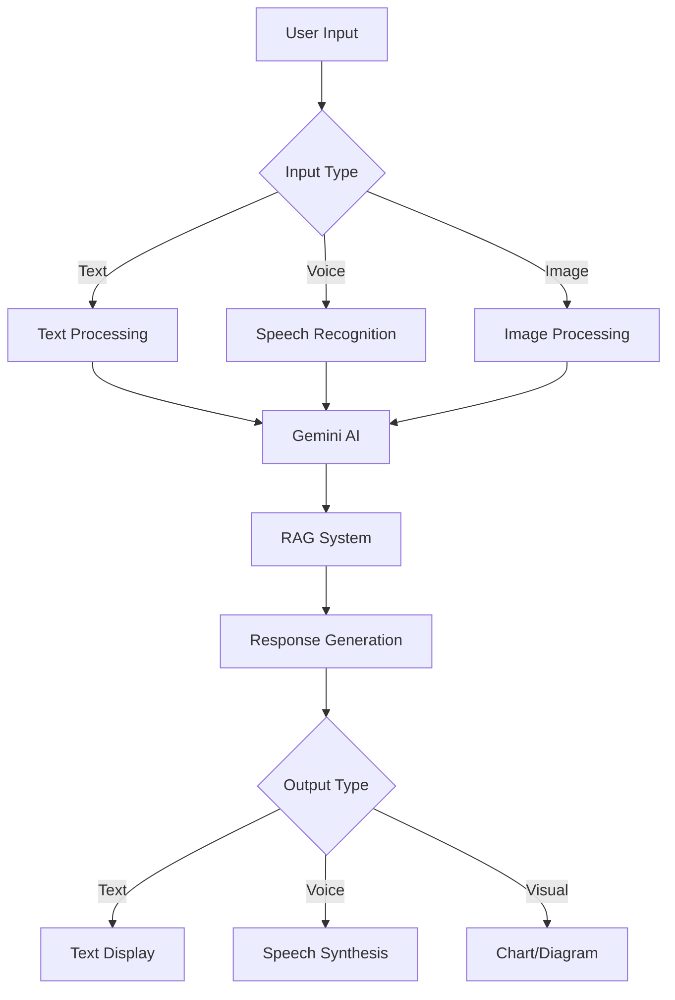

# 🚦 G-Traffic Heroes

<p align="center">
  
</p>

<p align="center">
  <strong>🇻🇳 Ứng dụng AI thông minh cho giáo dục An toàn Giao thông Việt Nam</strong>
</p>

<p align="center">
  <a href="#tính-năng-chính">Tính năng</a> •
  <a href="#công-nghệ">Công nghệ</a> •
  <a href="#cài-đặt">Cài đặt</a> •
  <a href="#sử-dụng">Sử dụng</a> •
  <a href="#kiến-trúc">Kiến trúc</a> •
  <a href="#đóng-góp">Đóng góp</a>
</p>

<p align="center">
  
  
  
  
  
</p>

---

## 🎯 Tổng quan

**G-Traffic Heroes** là ứng dụng giáo dục an toàn giao thông tiên tiến, được thiết kế cho **Cuộc thi Thiết kế sản phẩm tuyên truyền ATGT lần 5 năm 2025**. Ứng dụng kết hợp trí tuệ nhân tạo, gamification và học tập thích ứng để tạo ra trải nghiệm học tập thú vị và hiệu quả.

### 🏆 Mục tiêu
- **Giáo dục**: Nâng cao nhận thức về luật và an toàn giao thông
- **Tương tác**: Tạo môi trường học tập sinh động qua AI và gamification  
- **Cộng đồng**: Xây dựng mạng lưới "anh hùng giao thông" trên toàn quốc
- **Công nghệ**: Ứng dụng AI tiên tiến vào giáo dục an toàn giao thông

---

## ✨ Tính năng chính

### 🕵️ **1. Điệp viên Giao thông**
> **Hệ thống báo cáo cộng đồng thông minh**

- **📍 GPS Tracking**: Định vị chính xác điểm báo cáo
- **📸 AI Image Recognition**: Xác minh ảnh báo cáo tự động
- **🎖️ Gamification**: Hệ thống điểm thưởng và huy hiệu
- **🗺️ Interactive Map**: Bản đồ tương tác với Leaflet
- **📊 Analytics**: Thống kê và báo cáo chi tiết

### 🤖 **2. G-LawBot AI Chatbot**
> **Trợ lý AI chuyên về luật giao thông Việt Nam**

- **🚀 Gemini 2.0-flash**: AI model tiên tiến nhất của Google
- **🎤 Voice Interface**: Hỗ trợ giọng nói tiếng Việt (Speech-to-Text & Text-to-Speech)
- **📚 RAG System**: Retrieval-Augmented Generation với cơ sở dữ liệu luật VN
- **💬 Real-time Chat**: Trả lời tức thì 24/7
- **📖 Smart Context**: Hiểu ngữ cảnh và gợi ý chủ động

### 📚 **3. AI Quiz Generator**
> **Tạo bài kiểm tra thông minh từ tài liệu**

- **📄 Document Processing**: Xử lý PDF, DOCX với AI
- **🧠 Adaptive Learning**: Điều chỉnh độ khó theo năng lực học viên
- **📊 Analytics Dashboard**: Phân tích kết quả học tập chi tiết
- **🎯 Smart Questions**: Câu hỏi được tạo bởi AI dựa trên nội dung
- **📈 Progress Tracking**: Theo dõi tiến độ học tập cá nhân

### 🎓 **4. Traffic Explainer**
> **AI giải thích luật giao thông sinh động**

- **🎨 Visual Learning**: Giải thích trực quan và dễ hiểu
- **💡 Interactive Examples**: Ví dụ thực tế tương tác
- **📚 Category-based**: Phân loại theo chủ đề rõ ràng
- **🔄 Dynamic Content**: Nội dung cập nhật liên tục

### 🏫 **5. Community Integration**
> **Kết nối cộng đồng giáo dục**

- **👥 Multi-role Dashboard**: Học sinh, giáo viên, CSGT, phụ huynh
- **📊 Real-time Reports**: Báo cáo thời gian thực
- **🏆 School Rankings**: Xếp hạng trường/lớp
- **📱 Social Features**: Tính năng xã hội hóa

---

## 🛠️ Công nghệ

### **Frontend Core**
- **⚛️ React 19** - Framework UI hiện đại nhất với Server Components
- **📘 TypeScript 5.7** - Type safety và developer experience tốt nhất
- **🎨 Tailwind CSS v4** - Utility-first CSS framework mới nhất
- **⚡ Vite 6** - Build tool cực nhanh với HMR

### **UI/UX Libraries**
- **🎭 Shadcn/ui** - High-quality, accessible UI components
- **🎬 Framer Motion** - Advanced animations và transitions
- **📍 React Leaflet** - Interactive maps cho Traffic Agent
- **🎯 Lucide React** - Beautiful icons với React components

### **AI & Machine Learning**
- **🧠 Google Gemini 2.0-flash** - Multimodal AI model mạnh nhất
- **🔗 LangChain** - Framework for LLM applications
- **📊 Tiktoken** - Token counting và text processing
- **🎤 Web Speech API** - Native browser speech recognition

### **Data & State Management**
- **🗃️ Zustand** - Lightweight state management
- **📝 React Hook Form** - Performant forms với minimal re-renders
- **✅ Zod** - Type-safe schema validation
- **🔄 React Router v7** - Client-side routing mới nhất

### **Development Tools**
- **🔍 ESLint 9** - Modern linting với flat config
- **🏗️ TypeScript ESLint** - Advanced TypeScript rules
- **📦 npm Workspaces** - Monorepo management
- **🚀 GitHub Actions** - CI/CD automation

---

## 🚀 Cài đặt

### **Yêu cầu hệ thống**
```bash
Node.js >= 18.0.0
npm >= 8.0.0
Git >= 2.0.0
```

### **Clone và cài đặt**
```bash
# Clone repository
git clone https://github.com/your-org/g-traffic-heroes.git
cd g-traffic-heroes

# Cài đặt dependencies
npm install

# Thiết lập environment variables
cp .env.example .env
# Chỉnh sửa .env với API keys của bạn

# Khởi chạy development server
npm run dev
```

### **Environment Variables**
```bash
# Google AI API
VITE_GOOGLE_AI_API_KEY=your_gemini_api_key

# Optional: Additional services
VITE_OPENAI_API_KEY=your_openai_key
VITE_ANALYTICS_ID=your_analytics_id
```

### **Build cho production**
```bash
# Build ứng dụng
npm run build

# Preview build
npm run preview

# Lint code
npm run lint
```

---

## 💻 Sử dụng

### **1. Truy cập ứng dụng**
```
Development: http://localhost:5173
Production: https://g-traffic-heroes.vercel.app
```

### **2. Các tính năng chính**

#### **🕵️ Traffic Agent**
```
1. Truy cập /traffic-agent
2. Bật GPS và camera
3. Chụp ảnh vi phạm giao thông
4. AI sẽ xác minh và phân loại
5. Nhận điểm thưởng và huy hiệu
```

#### **🤖 G-LawBot AI**
```
1. Truy cập /chatbot
2. Nhập câu hỏi hoặc dùng voice input
3. Nhận câu trả lời từ Gemini AI
4. Khám phá tính năng voice synthesis
```

#### **📚 Quiz Generator**
```
1. Truy cập /quiz-generator
2. Upload file PDF/DOCX
3. AI sẽ tạo bài quiz tự động
4. Làm bài và xem kết quả phân tích
```

#### **🎓 Traffic Explainer**
```
1. Truy cập /traffic-explainer  
2. Chọn chủ đề muốn học
3. Đọc giải thích chi tiết từ AI
4. Tương tác với examples
```

### **3. Voice Features (Chrome/Edge)**
```bash
# Speech-to-Text
🎤 Click microphone button → Nói câu hỏi → AI trả lời

# Text-to-Speech  
🔊 Enable auto-speak → AI sẽ đọc câu trả lời
🔊 Click speaker icon → Đọc tin nhắn cụ thể
```

---

## 🏗️ Kiến trúc

### **Project Structure**
```
src/
├── 🎯 components/          # Shared UI components (Shadcn/ui)
├── 🎨 features/           # Feature-based modules
│   ├── 🏠 homepage/        # Landing page
│   ├── 🤖 chatbot/         # AI chatbot với voice
│   ├── 🕵️ traffic-agent/   # GPS reporting system  
│   ├── 📚 quiz-generator/   # AI quiz creation
│   ├── 🎓 traffic-explainer/ # AI content explanation
│   └── 📊 adaptive-learning/ # Learning analytics
├── 🔧 lib/               # Shared utilities
│   ├── 🧠 speech-recognition.ts  # Voice input
│   ├── 🔊 speech-synthesis.ts    # Voice output  
│   ├── 📄 pdf-processor.ts       # Document processing
│   └── 🤖 rag-service.ts         # AI retrieval system
├── 🎛️ hooks/             # Custom React hooks
├── 🎨 styles/            # Global styles
└── 📝 types/             # TypeScript definitions
```

### **Feature Architecture**
```
features/[feature-name]/
├── 📁 components/        # Feature-specific components
├── 🪝 hooks/            # Feature-specific hooks  
├── 📊 data/             # Static data và mock
├── 🔧 utils/            # Feature utilities
├── 📝 types.ts          # Feature types
└── 📄 README.md         # Feature documentation
```

### **AI Integration Flow**


---

## 🎮 Tính năng Voice AI

### **Speech-to-Text**
- **🎯 Vietnamese Optimized**: Tối ưu cho tiếng Việt
- **⚡ Real-time**: Nhận dạng giọng nói thời gian thực
- **🔄 Continuous**: Hỗ trợ nói liên tục
- **🎛️ Multi-language**: Việt, Anh (US), Anh (UK)

### **Text-to-Speech**
- **🤖 Auto-speak**: Tự động đọc phản hồi từ AI
- **⚙️ Voice Settings**: Chọn giọng đọc và tốc độ
- **🎵 Natural Voice**: Giọng đọc tự nhiên và rõ ràng
- **⏸️ Playback Control**: Dừng, tiếp tục, điều chỉnh tốc độ

### **Browser Support**
| Browser | Speech Recognition | Speech Synthesis |
|---------|-------------------|------------------|
| Chrome ✅ | Full Support | Full Support |
| Edge ✅ | Full Support | Full Support |
| Safari ⚠️ | Limited | Full Support |
| Firefox ❌ | Not Supported | Basic Support |

---

## 🧪 Testing

### **Test Commands**
```bash
# Run all tests
npm test

# Run with coverage
npm run test:coverage

# Run E2E tests
npm run test:e2e

# Visual regression tests
npm run test:visual
```

### **Test Structure**
```
__tests__/
├── 🧩 components/        # Component unit tests
├── 🪝 hooks/            # Custom hooks tests
├── 🤖 ai/               # AI integration tests
├── 🎤 voice/            # Voice features tests
└── 🌊 e2e/              # End-to-end tests
```

---

## 🚀 Deployment

### **Vercel (Recommended)**
```bash
# Install Vercel CLI
npm i -g vercel

# Deploy
vercel --prod
```

### **Netlify**
```bash
# Build command
npm run build

# Publish directory
dist
```

### **Docker**
```dockerfile
FROM node:18-alpine
WORKDIR /app
COPY package*.json ./
RUN npm ci --only=production
COPY . .
RUN npm run build
EXPOSE 3000
CMD ["npm", "run", "preview"]
```

---

## 📊 Performance

### **Core Web Vitals**
- **⚡ LCP**: < 2.5s (Largest Contentful Paint)
- **🎯 FID**: < 100ms (First Input Delay)  
- **📏 CLS**: < 0.1 (Cumulative Layout Shift)

### **Optimization Features**
- **🔄 Code Splitting**: Route-based lazy loading
- **📦 Tree Shaking**: Unused code elimination
- **🗜️ Asset Compression**: Automatic Vite optimization
- **📱 Progressive Enhancement**: Graceful feature degradation

---

## 🤝 Đóng góp

### **Development Workflow**
```bash
# 1. Fork repository
# 2. Tạo feature branch
git checkout -b feature/amazing-feature

# 3. Commit changes
git commit -m "✨ Add amazing feature"

# 4. Push to branch  
git push origin feature/amazing-feature

# 5. Tạo Pull Request
```

### **Contribution Guidelines**
- **📋 Issues**: Mô tả chi tiết bug hoặc feature request
- **🔀 Pull Requests**: Include tests và documentation
- **📝 Commit Messages**: Follow conventional commits
- **🧪 Testing**: Ensure all tests pass
- **📚 Documentation**: Update relevant docs

### **Code Style**
```bash
# Lint code
npm run lint

# Format code
npm run format

# Type check
npm run type-check
```

---

## 📈 Roadmap

### **Version 2.0** 🚧
- [ ] **🎮 Advanced Gamification**: Missions, achievements, leaderboards
- [ ] **👥 Social Features**: Friend system, team challenges
- [ ] **📱 Mobile App**: React Native hoặc PWA
- [ ] **🌍 Multi-language**: English, Chinese, Japanese

### **Version 2.1** 📋
- [ ] **🤖 Advanced AI**: Custom training models
- [ ] **🎬 Video Processing**: AI phân tích video vi phạm
- [ ] **🔔 Push Notifications**: Real-time alerts
- [ ] **📊 Advanced Analytics**: Machine learning insights

### **Version 3.0** 🔮
- [ ] **🥽 AR Features**: Augmented reality traffic signs
- [ ] **🚗 IoT Integration**: Smart vehicle connectivity
- [ ] **🧠 Predictive AI**: Traffic accident prediction
- [ ] **🌐 Global Expansion**: International traffic laws

---

## 📄 License

```
MIT License

Copyright (c) 2025 G-Traffic Heroes Team

Permission is hereby granted, free of charge, to any person obtaining a copy
of this software and associated documentation files (the "Software"), to deal
in the Software without restriction, including without limitation the rights
to use, copy, modify, merge, publish, distribute, sublicense, and/or sell
copies of the Software, and to permit persons to whom the Software is
furnished to do so, subject to the following conditions:

The above copyright notice and this permission notice shall be included in all
copies or substantial portions of the Software.

THE SOFTWARE IS PROVIDED "AS IS", WITHOUT WARRANTY OF ANY KIND, EXPRESS OR
IMPLIED, INCLUDING BUT NOT LIMITED TO THE WARRANTIES OF MERCHANTABILITY,
FITNESS FOR A PARTICULAR PURPOSE AND NONINFRINGEMENT. IN NO EVENT SHALL THE
AUTHORS OR COPYRIGHT HOLDERS BE LIABLE FOR ANY CLAIM, DAMAGES OR OTHER
LIABILITY, WHETHER IN AN ACTION OF CONTRACT, TORT OR OTHERWISE, ARISING FROM,
OUT OF OR IN CONNECTION WITH THE SOFTWARE OR THE USE OR OTHER DEALINGS IN THE
SOFTWARE.
```

---

## 🙏 Acknowledgments

### **Tổ chức**
- **🏆 Hội Liên hiệp Thanh niên Việt Nam TP.HCM**
- **🔬 Trung tâm Phát triển Khoa học và Công nghệ Trẻ**
- **🚦 Cuộc thi Thiết kế sản phẩm tuyên truyền ATGT lần 5 năm 2025**

### **Công nghệ**
- **🧠 Google Gemini AI** - Advanced multimodal AI capabilities
- **⚛️ React Team** - Amazing React 19 features
- **🎨 Tailwind Labs** - Beautiful utility-first CSS
- **🎭 Shadcn** - High-quality component library

### **Cộng đồng**
- **👨‍💻 Open Source Community** - Inspiration và best practices
- **🇻🇳 Vietnamese Developers** - Local insights và feedback
- **🎓 Education Community** - Learning và teaching expertise

---

<p align="center">
  <strong>🚦 Tạo bởi AI và tình yêu với giao thông Việt Nam 🇻🇳</strong>
</p>

<p align="center">
  <a href="https://g-traffic-heroes.vercel.app">🌐 Live Demo</a> •
  <a href="https://github.com/your-org/g-traffic-heroes/issues">🐛 Report Bug</a> •
  <a href="https://github.com/your-org/g-traffic-heroes/discussions">💡 Request Feature</a>
</p>
